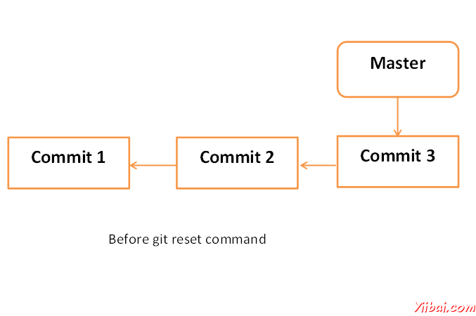
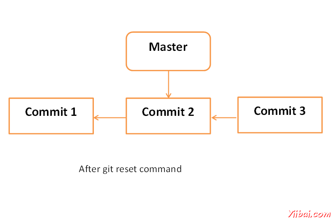

# Git 修正错误 - Git教程

大部分的人都会犯错。所以每VCS提供了一个功能，修正错误，直到特定的点。 Git提供功能使用，我们可以撤销已作出的修改到本地资源库。

假设用户不小心做了一些更改，以他的本地的仓库，现在他要扔掉这些变化。在这种情况下，恢复操作中起着重要的作用。

## 恢复未提交的更改

让我们假设Jerry 不小心修改文件从自己的本地仓库。但他想扔掉他的修改。要处理这种情况，我们可以使用git checkout命令。我们可以使用这个命令来恢复文件的内容。

```
[jerry@CentOS src]$ pwd
/home/jerry/jerry_repo/project/src

[jerry@CentOS src]$ git status -s
M string_operations.c

[jerry@CentOS src]$ git checkout string_operations.c

[jerry@CentOS src]$ git status –s

```

甚至我们可以使用git checkout命令删除的文件从本地库。让我们假设Tom 删除文件从本地存储库，我们希望这个文件。我们可以做到这一点，使用相同的命令。

```
[tom@CentOS src]$ pwd
/home/tom/top_repo/project/src

[tom@CentOS src]$ ls -1
Makefile
string_operations.c

[tom@CentOS src]$ rm string_operations.c

[tom@CentOS src]$ ls -1
Makefile

[tom@CentOS src]$ git status -s
D string_operations.c

```

Git是显示文件名前的字母D。这标志着该文件已被删除，从本地资源库。

```
[tom@CentOS src]$ git checkout string_operations.c

[tom@CentOS src]$ ls -1
Makefile
string_operations.c

[tom@CentOS src]$ git status -s

```

&gt; 注意：我们可以执行所有这些操作之前提交操作。

## 删除临时区域变化

我们已经看到，当我们执行加法运算;文件移动从本地存储库，参数区域。如果用户不小心修改一个文件，并把它添加到临时区域，但他马上意识到犯了错误。他希望恢复他的改变。我们可以处理这种情况下，通过使用git checkout命令。

在Git是一个HEAD指针始终指向最新提交。如果想撤销变更分阶段区域，那么可以使用git checkout命令，但checkout命令，必须提供额外的参数HEAD指针。额外提交指针参数指示的git checkout命令，重置工作树，还能够去除分阶段。

让我们假设Tom 从自己的本地仓库修改一个文件。如果我们查看这个文件的​​状态，它会显示文件被修改，但不加入临时区域。

```
tom@CentOS src]$ pwd
/home/tom/top_repo/project/src
# Unmodified file

[tom@CentOS src]$ git status -s

# Modify file and view it’s status.
[tom@CentOS src]$ git status -s
M string_operations.c

[tom@CentOS src]$ git add string_operations.c

```

Git 的状态显示该文件是在分期区域，现在它恢复使用git checkout命令和视图状态恢复的文件。

```
[tom@CentOS src]$ git checkout HEAD -- string_operations.c

[tom@CentOS src]$ git status -s

```

## 将HEAD指针与GIT复位

做一些改变后，可能会决定删除这些更改。 Git 复位命令是用来重置或恢复一些变化。我们可以执行三种不同类型的复位操作。

下图显示图形表示 Git复位命令。




### SOFT

每个分支都有HEAD 指针指向最新提交。如果我们使用git  --soft复位命令选项，随后提交ID，然后将只有头指针复位，不破坏任何东西。

.git/refs/heads/master 文件存储的提交ID 的HEAD 指针。我们可以验证它通过使用git log -1 命令。

```
[jerry@CentOS project]$ cat .git/refs/heads/master
577647211ed44fe2ae479427a0668a4f12ed71a1

```

现在查看最新提交的ID，这将配合上述提交ID。

```
[jerry@CentOS project]$ git log -2

```

上面的命令会产生以下结果。

```
commit 577647211ed44fe2ae479427a0668a4f12ed71a1
Author: Tom Cat <tom@yiibai.com>
Date: Wed Sep 11 10:21:20 2013 +0530

Removed executable binary

commit 29af9d45947dc044e33d69b9141d8d2dad37cc62
Author: Jerry Mouse <jerry@yiibai.com>
Date: Wed Sep 11 10:16:25 2013 +0530

Added compiled binary

```

让我们重设HEAD 指针。

```
[jerry@CentOS project]$ git reset --soft HEAD~

```

现在我们只重设HEAD 指针回到一个位置。让我们检查内容.git/refs/heads/master 文件.

```
[jerry@CentOS project]$ cat .git/refs/heads/master
29af9d45947dc044e33d69b9141d8d2dad37cc62

```

从文件提交ID改变，现在验证通过查看提交的信息。

```
jerry@CentOS project]$ git log -2

```

上面的命令会产生以下结果。

```
commit 29af9d45947dc044e33d69b9141d8d2dad37cc62
Author: Jerry Mouse <jerry@yiibai.com>
Date: Wed Sep 11 10:16:25 2013 +0530

Added compiled binary

commit 94f7b26005f856f1a1b733ad438e97a0cd509c1a
Author: Jerry Mouse <jerry@yiibai.com>
Date: Wed Sep 11 10:08:01 2013 +0530

Added Makefile and renamed strings.c to string_operations.c

```

### 混合

Git的复位 -- mixed选项从分段区域尚未提交还原更改。它仅恢复变化形成暂存区。实际所做的更改到工作副本的文件不受影响。默认的Git的复位相当于git的复位 -- mixed。

有关更多详细信息，请参阅部分删除同一章临时区域变化。

### HARD

如果使用 - hard选项用 Git复位命令，它会清除暂存区域，它会重设HEAD 指针，以最后一次提交的具体提交ID，也删除本地文件的变化。

让我们检查提交的ID

```
[jerry@CentOS src]$ pwd
/home/jerry/jerry_repo/project/src

[jerry@CentOS src]$ git log -1

```

上面的命令会产生以下结果。

```
commit 577647211ed44fe2ae479427a0668a4f12ed71a1
Author: Tom Cat <tom@yiibai.com>
Date: Wed Sep 11 10:21:20 2013 +0530

Removed executable binary

```

Jerry 修改过的文件，在文件的开始，加入单行注释。

```
[jerry@CentOS src]$ head -2 string_operations.c
/* This line be removed by git reset operation */
#include <stdio.h>

```

他使用git status命令验证。

```
[jerry@CentOS src]$ git status -s
M string_operations.c

```

Jerry 修改后的文件添加到分期区域，并验证它与git的状态运行。

```
[jerry@CentOS src]$ git add string_operations.c
[jerry@CentOS src]$ git status

```

上面的命令会产生以下结果。

```
# On branch master
# Changes to be committed:
# (use "git reset HEAD <file>..." to unstage)
#
#
modified: string_operations.c
#

```

Git的状态，显示该文件是在临时区域。现在重置HEAD  用 --hard选项。

```
[jerry@CentOS src]$ git reset --hard 577647211ed44fe2ae479427a0668a4f12ed71a1

HEAD is now at 5776472 Removed executable binary

```

Git 复位命令成功，这将恢复从分段区的文件，以及删除本地对文件所做的更改。

```
[jerry@CentOS src]$ git status -s

```

Git 状态显示，文件恢复从分段区。

```
[jerry@CentOS src]$ head -2 string_operations.c
#include <stdio.h>

```

Head 命令还显示，复位操作删除局部变化。
