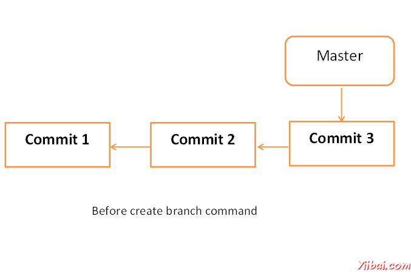
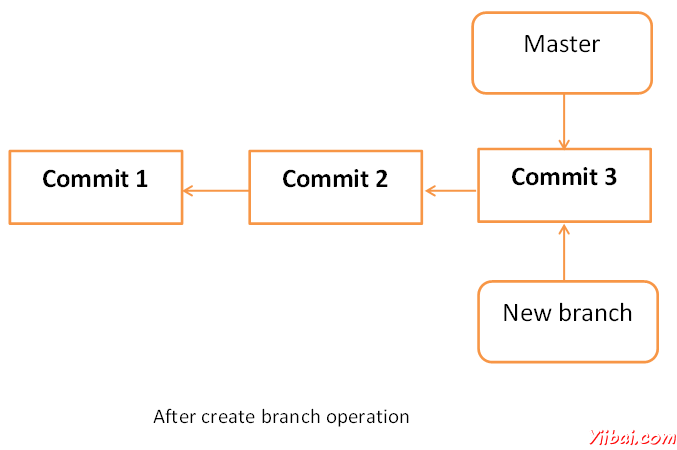
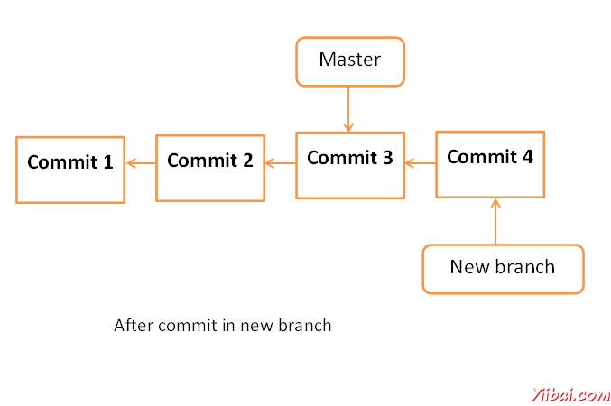
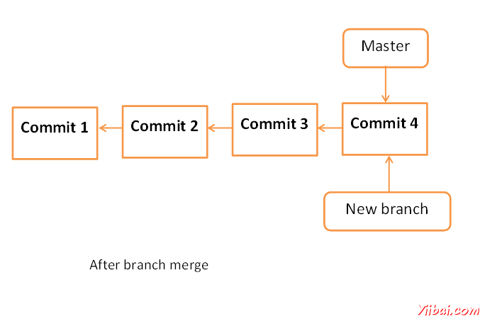

# Git 管理分支 - Git教程

分支操作可以创造另一条线的发展。对fork过程分为两个不同的方向发展，我们可以使用此操作。例如，我们发布了6.0版本的产品，我们可能要创建一个分支，使7.0功能的发展可以保持独立从6.0 bug修复。

## 创建分支

使用Git分支&lt;branch name&gt; 命令创建新的分支。从现有的，我们可以创建一个新的分支。我们可以使用特定的提交或标签作为一个起点。如果没有提供任何具体的提交ID，然后分支将HEAD 创建作为一个起点。

```
[jerry@CentOS src]$ git branch new_branch

[jerry@CentOS src]$ git branch
* master
new_branch

```

创建新的分支，Tom用 git branch命令列出可用的分支。 Git会显示星号标记之前，当前检出的分支。 

下面是创建分支操作的图形表示




## 切换分支

Jerry 使用git checkout命令到分支之间切换。

```
[jerry@CentOS src]$ git checkout new_branch
Switched to branch 'new_branch'
[jerry@CentOS src]$ git branch
master
* new_branch

```

## 创建和切换分支的快捷方式

在上面的例子中，我们使用了两个命令来创建和切换分支。 Git提供checkout命令 -b选项，此操作将创建新的分支，并立即切换到新的分支。

```
[jerry@CentOS src]$ git checkout -b test_branch
Switched to a new branch 'test_branch'

[jerry@CentOS src]$ git branch
master
new_branch
* test_branch

```

## 删除分支

一个分支可以用git branch命令的-D选项被删除。但在此之前，删除现有的分支切换到其他分支。

Jerry 当前在test_branch 想要删除该分支。于是，他分支和删除分支切换，如下图所示。

```
[jerry@CentOS src]$ git branch
master
new_branch
* test_branch

[jerry@CentOS src]$ git checkout master
Switched to branch 'master'

[jerry@CentOS src]$ git branch -D test_branch
Deleted branch test_branch (was 5776472).

```

现在Git会显示只有两个分支。

```
[jerry@CentOS src]$ git branch
* master
new_branch

```

## 重命名分支

Jerry 决定添加宽字符支持他的字符串操作项目。他已经创建了一个新的分支，但分支名称是不恰当的。于是，他通过使用-m选项，其次是旧分支名称和新分支名称变更分支名称。

```
[jerry@CentOS src]$ git branch
* master
new_branch

[jerry@CentOS src]$ git branch -m new_branch wchar_support

```

现在git branch命令将显示新分支名称。

```
[jerry@CentOS src]$ git branch
* master
wchar_support

```

## 合并两个分支

Jerry 实现函数返回字符串的长度为宽字符串。新代码将看起来像这样

```
[jerry@CentOS src]$ git branch
master
* wchar_support

[jerry@CentOS src]$ pwd
/home/jerry/jerry_repo/project/src

[jerry@CentOS src]$ git diff

```

上面的命令会产生以下结果。

```
t a/src/string_operations.c b/src/string_operations.c
index 8ab7f42..8fb4b00 100644
--- a/src/string_operations.c
+++ b/src/string_operations.c
@@ -1,4 +1,14 @@
#include <stdio.h>
+#include <wchar.h>
+
+size_t w_strlen(const wchar_t *s)
+{
+
const wchar_t *p = s;
+
+
while (*p)
+ ++p;
+ return (p - s);
+}

```

测试后，他提交他的变化，并推到新的分支。

```
[jerry@CentOS src]$ git status -s
M string_operations.c
?? string_operations

[jerry@CentOS src]$ git add string_operations.c

[jerry@CentOS src]$ git commit -m 'Added w_strlen function to return string lenght of wchar_t
string'

[wchar_support 64192f9] Added w_strlen function to return string lenght of wchar_t string
1 files changed, 10 insertions(+), 0 deletions(-)

```

注意杰里推动这些变化的新分支，这就是为什么他用wchar_support分支的名称，而不是master分支。

```
[jerry@CentOS src]$ git push origin wchar_support **<−−−−−−−−−−−−− Observer branch_name**

```

上面的命令会产生以下结果。

```
Counting objects: 7, done.
Compressing objects: 100% (4/4), done.
Writing objects: 100% (4/4), 507 bytes, done.
Total 4 (delta 1), reused 0 (delta 0)
To gituser@git.server.com:project.git
* [new branch]
wchar_support -> wchar_support

```

经过分支提交的变化，新分支会这个样子。



Tom 好奇Jerry 在做什么在他的私人分支，这就是为什么他检查日志从wchar_support 分支。

```
[tom@CentOS src]$ pwd
/home/tom/top_repo/project/src

[tom@CentOS src]$ git log origin/wchar_support -2

```

上面的命令会产生以下结果。

```
commit 64192f91d7cc2bcdf3bf946dd33ece63b74184a3
Author: Jerry Mouse <jerry@yiibai.com>
Date: Wed Sep 11 16:10:06 2013 +0530

Added w_strlen function to return string lenght of wchar_t string

commit 577647211ed44fe2ae479427a0668a4f12ed71a1
Author: Tom Cat <tom@yiibai.com>
Date: Wed Sep 11 10:21:20 2013 +0530

Removed executable binary

```

通过查看提交的信息，Tom 意识到Jerry 实现宽字符strlen 函数，他希望同样的功能集成到主分支。而不是重新实现他的分支合并到主分支，他决定采用杰里的代码。

```
[tom@CentOS project]$ git branch
* master

[tom@CentOS project]$ pwd
/home/tom/top_repo/project

[tom@CentOS project]$ git merge origin/wchar_support
Updating 5776472..64192f9
Fast-forward
src/string_operations.c | 10 ++++++++++
1 files changed, 10 insertions(+), 0 deletions(-)

```

合并操作后的主分支会这个样子。



现在wchar_support分支合并到主分支中我们可以验证它的查看提交信息，通过查看修改成string_operation.c文件。

```
[tom@CentOS project]$ cd src/

[tom@CentOS src]$ git log -1

commit 64192f91d7cc2bcdf3bf946dd33ece63b74184a3
Author: Jerry Mouse <jerry@yiibai.com>Date: Wed Sep 11 16:10:06 2013 +0530

Added w_strlen function to return string lenght of wchar_t string

[tom@CentOS src]$ head -12 string_operations.c</jerry@yiibai.com> 
```

上面的命令会产生以下结果。

```
#include <stdio.h>
#include <wchar.h>
size_t w_strlen(const wchar_t *s)
{
   const wchar_t *p = s;

   while (*p)
      ++p;

   return (p - s);
}
```

经过测试，他把他的代码更改到主分支。

```
[tom@CentOS src]$ git push origin master
Total 0 (delta 0), reused 0 (delta 0)
To gituser@git.server.com:project.git
5776472..64192f9 master −> master

```

## 重订分支

Git 的 rebase命令的一个分支合并的命令，但不同的是，它修改提交的顺序。

Git merge命令，试图把从其他分支提交当前的本地分支的HEAD上。例如 本地的分支已经提交A-&gt; B-&gt; C-&gt; D和合并分支已提交A-&gt; B-&gt; X&gt; Y，则Git合并将当前转换像这样的本地分行A-&gt; B-&gt; C-&gt; D-&gt; X-&gt; Y

Git 的rebase命令试图找到当前的本地分支和合并分支之间的共同祖先。然后把修改提交的顺序，在当前的本地分支提交中的本地分支。例如，如果当地的分支已提交A-&gt; B-&gt; C-&gt; D和合并分支已提交A-&gt; B-&gt; X-&gt; Y，Git衍合的类似A-&gt; B转换成当前的本地分支A−&gt;B−&gt;X−&gt;Y−&gt;C−&gt;D

当多个开发人员在一个单一的远程资源库的工作，你不能在远程仓库提交修改订单。在这种情况下，可以使用变基操作把本地提交的远程仓库之上的提交，可以推送这些变化。

 