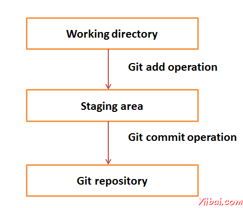

# Git 基本概念 - Git教程

## 版本控制系统 (VCS)

版本控制系统 (VCS) 是软件，帮助软件开发人员携手合作，他们的工作并保持完整的历史。

以下是VCS目标

1.  允许开发人员同步工作.

2.  不要覆盖对方的变化.

3.  维护历史的每一个版本.

以下是常见的VCS

1.  集中式版本控制系统（CVCS）

2.  分散式/分布式版本控制系统（DVCS）

在这个教程，我们将介绍集中分布式的版本控制系统，尤其是[Git](http://www.yiibai.com/git)。 Git 属于分布式版本控制系统。

## 分布式版本控制系统（DVCS）

集中式版本控制系统采用中央服务器上存储的所有文件和实现团队协作。但是CVCS主要缺点是中央服务器的单点故障，即故障。不幸的是，如果中央服务器宕机一小时，然后在该时段没有人可以合作。即使在最坏的情况下，如果中央服务器的磁盘被损坏，并没有采取适当的备份，那么将失去整个项目的历史。 

DVCS客户不仅检出的最新快照目录，但他们也完全反映资源库。如果SEVER停机，然后从任何客户端库可以复制回服务器，以恢复它。每个结账是完整的版本库备份。 Git不会依赖中央服务器，这就是为什么可以执行许多操作，当处于脱机状态。可以提交修改，创建分支视图日志和执行其他操作，当处于脱机状态。只需要网络连接，发布您的更改，并采用最新变化。

## Git优势

Git是GPL开源许可证下发布的。它可自由在互联网上。可以使用Git来管理项目无需支付一分钱。由于它是开源的，可以下载它的源代码，并根据要求进行更改。

由于大部分的操作都在本地执行，它给人带来巨大的好处，在速度方面。 Git 不依赖于中央服务器，为什么每一个操作就没有必要与远程服务器进行交互。 Git核心部分是写在C中，从而避免了与其他高级语言的运行时开销。虽然 Git中反映整个存储库，在客户端上的数据的大小是小的。这说明它是在客户端上的数据压缩和存储的效率有多高。

丢失数据的机会是非常罕见的，当有多个副本。存在于任何客户端的数据存储库中，因此它可以被用来在发生崩溃或磁盘损坏的镜像。

Git使用常见的加密散列函数，称为安全的哈希算法（SHA1）命名，并确定在其数据库中的对象。每一个文件并提交检查总结和检索其校验在结账的时候。意思是说，这是不可能改变文件，日期，提交信息和且从Git 数据库不知道Git 任何其他数据。

在CVCS情况下，中心服务器需要足够强大，要求整个团队服务。对于较小的团队，这是不是一个问题，但随着团队规模的增长，服务器的硬件限制可能成为一个性能瓶颈。在DVCS开发的情况下不与服务器进行交互，除非他们需要推或拉的变化。所有繁重发生在客户端上，所以服务器硬件可以是很简单的。

CVCS使用廉价的复制机制，这意味着如果我们创建新的分支，它会复制到新分支的所有代码，所以它的耗时和效率不高。另外CVCS的分支的删除和合并是复杂和费时的。但是，使用Git分支管理是很简单的。只需要几秒钟，创建，删除和合并分支。

1.  自由和开放源码

2.  快速和小

3.  隐式备份

4.  安全

5.  不需要强大的硬件

6.  更简单的分支

## DVCS术语

### 本地资源库

每个VCS工具提供私有工作场所的工作副本。开发者在他的私人工作场所的变化，并提交这些更改后成为仓库的一部分。 Git的需要这一步，为他们提供的专用副本是整个仓库。用户可以执行许多操作，这个库中，如添加文件，删除文件，重命名文件，移动文件，提交改变，还有更多。

### 工作目录，暂存区域或索引

工作目录是地方文件检出。其他CVCS开发商一般不修改，并承诺他的变化，直接向版本库。但Git使用不同的策略。 Git不会跟踪每一个修改过的文件。每当提交操作，Git在目前临时区域的文件。只有文件被认为是目前在临时区域提交，而不是所有修改过的文件。

让我们来看看Git的基本工作流程。

第1步：修改文件的工作目录。

第2步：将这些文件添加到暂存区

第3步：执行commit操作。这将文件从临时区域。推送操作后，它永久地存储更改的Git仓库



假设修改了两个文件，即 “sort.c” and “search.c” ，两种不同分别 提交操作。可以添加一个文件分段区域，不提交。第一次提交后重复相同的步骤为另一个文件。

```
# First commit
[bash]$ git add sort.c

# adds file to the staging area
[bash]$ git commit –m “Added sort operation”

```

```
# Second commit
[bash]$ git add search.c

# adds file to the staging area
[bash]$ git commit –m “Added search operation”

```

### BLOBS

BLOB代表二进制大对象。为代表 blob文件的每个版本。一个blob保存文件数据，但不包含任何有关文件的元数据。它是一个二进制文件，该文件它被命名为SHA1哈希 Git数据库中。在Git中，文件未提及的名字。一切固定内容寻址。

### Tree

树是一个对象，它表示一个目录。它拥有blobs以及其他子目录。一棵树是一个二进制文件，该文件存储Blob树，也被命名为树对象的SHA1哈希的引用。

### Commit

提交持有的库的当前状态。COMMIT命令同样由SHA1哈希的名字命名。可以考虑commit对象的链表节点。每个提交的对象有父commit 对象的指针。从给定的承诺可以遍历寻找在父指针，查看历史记录的提交。如果提交多个父承诺，这意味着特定的提交是由两个分支合并。

### BRANCHES

分支用来创建另一条线的发展。默认情况下，Git的主分支，这是一样躯干颠覆。平时要工作的新功能创建一个分支。功能完成后，它被合并回master分支，我们删除分支。每个分支所引用HEAD，这点在分支的最新提交。每当做出了一个提交，HEAD更新为最新提交。

### TAGS

包括特定版本库中的标签分配一个有意义的名称。标签是非常相似的分支，但不同的是，标签是不可改变的。手段标记的一个分支，没有人打算修改。一旦标签被创建为特定的提交，即使创建一个新的提交，也不会被更新。通常开发人员创建标签的产品发布。

### CLONE

克隆操作的库创建实例。克隆操作不仅检出的工作拷贝，但它也反映了完整的信息库。用户可以执行许多操作，这个本地仓库。网络介入是唯一的一次，当正在同步资料库实例。

### PULL

Pull操作复制的变化，本地的一个实例来从远程仓库。Pull操作是用于两个存储库实例之间的同步。这是在Subversion更新操作一样。

### PUSH

推动从本地存储库实例的远程操作副本的变化。这是用来储存到Git仓库中永久改变。这是在Subversion的提交操作相同。

### HEAD

HEAD指针总是指向分支的最新提交。每当你做出了一个提交，HEAD更新为最新提交。HEAD树枝存储在.git/refs/heads/ 目录中。

```
[CentOS]$ ls -1 .git/refs/heads/
master

[CentOS]$ cat .git/refs/heads/master
570837e7d58fa4bccd86cb575d884502188b0c49

```

### REVISION

修订版本的源代码。在Git修订代表的提交。这些提交由SHA1安全哈希值确定。

### URL

URL代表的Git仓库的位置。 Git 的URL存储在配置文件中。

```
[tom@CentOS tom_repo]$ pwd
/home/tom/tom_repo

[tom@CentOS tom_repo]$ cat .git/config
[core]
repositoryformatversion = 0
filemode = true
bare = false
logallrefupdates = true
[remote "origin"]
**url = gituser@git.server.com:project.git**
fetch = +refs/heads/*:refs/remotes/origin/*
```

 