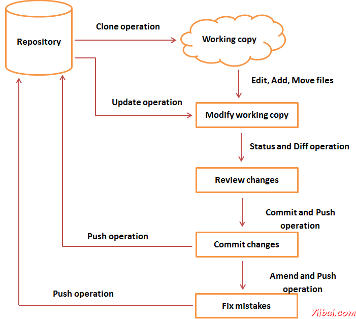

# Git 生命周期 - Git教程

在本章中，我们将讨论的Git的生命周期。在后面的章节中，我们将看到的Git命令为每个操作。

一般工作流程是这样的：

1.  克隆Git仓库作为工作副本。

2.  可以添加/编辑文件，修改工作副本。

3.  如果有必要，你还服用其他开发人员的变化，更新工作副本。

4.  审查前提交。

5.  提交修改。如果一切都很好，然后推到存储库的更改。

6.  提交之后，如果知道是什么错误，那么纠正最后一次提交，并推送修改到版本库。

以下是工作流程的图形表示。

 