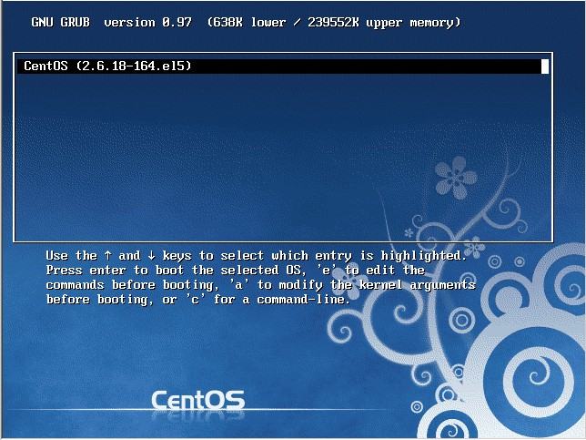
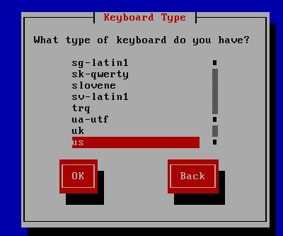
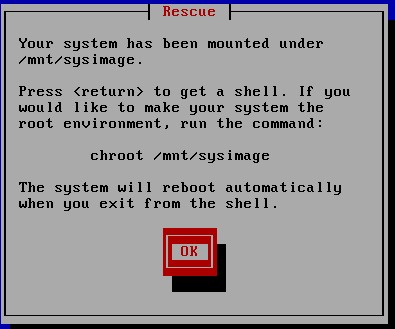

# Linux 忘记密码解决方法

很多朋友经常会忘记Linux系统的root密码，linux系统忘记root密码的情况该怎么办呢？重新安装系统吗？当然不用！进入单用户模式更改一下root密码即可。

步骤如下：

### 重启linux系统

3 秒之内要按一下回车，出现如下界面

然后输入e

在 第二行最后边输入 single，有一个空格。具体方法为按向下尖头移动到第二行，按"e"进入编辑模式

在后边加上single 回车

最后按"b"启动，启动后就进入了单用户模式了

此时已经进入到单用户模式了，你可以更改root密码了。更密码的命令为 passwd

【**使用系统安装光盘的救援模式**】

救援模式即rescue ，这个模式主要是应用于，系统无法进入的情况。如，grub损坏或者某一个配置文件修改出错。如何使用rescue模式呢？

光盘启动，按F5 进入rescue模式

输入linux rescue 回车

选择语言，笔者建议你选择英语

选择us 键盘

这里问你是否启动网络，有时候可能会联网调试。我们选no

这里告诉我们，接下来会把系统挂载在/mnt/sysimage 中。

其中有三个选项:

*   Continue 就是挂载后继续下一步。 
*   Read-Only 挂载成只读，这样更安全，有时文件系统损坏时，只读模式会防止文件系统近一步损坏。
*   Skip就是不挂载，进入一个命令窗口模式。 

这里我们选择Continue。

至此，系统已经挂载到了/mnt/sysimage中。接下来回车，输入chroot /mnt/sysimage 进入管理员环境。

**提示：** 其实也可以到rescue模式下更改root的密码的。这个rescue模式和windows PE系统很相近。

当运行了chroot /mnt/sysimage/ 后，再ls 看到目录结构和原来系统中的目录结构是一样的。

没错！现在的环境和原来系统的环境是一模一样的。你可以输入exit 或者按Ctrl + D退出这个环境。然后你再ls 看一下

这个目录其实就是rescue模式下的目录结构，而我们的系统文件全部在 /mnt/sysimage目录下。

