# UML构建模块 - UML

UML描述的实时系统，这是非常重要的一个概念模型，然后进行逐渐。 [UML](http://www.yiibai.com/html/uml)的概念模型可以通过学习掌握以下三大要素：

*   UML构建模块
*   规则连接构建模块
*   UML的公共机制

本章介绍了所有的UML构建块。 UML的构建块可以被定义为：

*   物件
*   关系
*   图

## (1) 物件:

物件是最重要的UML构建块。物件可以:

*   结构化
*   行为化
*   分组
*   注解

## 结构化物件:

结构性的东西定义静态模型的一部分​​。他们代表了物理和概念元素。以下是简要描述的结构的东西.

## 类:

具有类似职责的对象类表示.

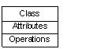

## 接口:

接口定义了一组操作指定一个类的职责。

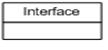

## 协作:

协作定义元素之间的相互作用。

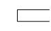

## 用例:

用例代表了一组由系统的行动，为一个特定的目标。

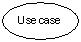

## 组件:

组件描述物理系统的一部分。

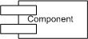

## 节点:

一个节点可以被定义为在运行时存在的物理元素。

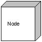

## 行为物件:

行为由UML模型中的动态部分。以下是行为的东西:

## 交互:

交互被定义为一种行为，包括一组元素之间的消息交换来完成特定的任务。

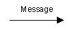

## 状态机器:

状态机是有用的，当一个对象在其生命周期的状态是很重要的。它定义了一个对象的状态序列通过对事件的响应。活动负责外部因素状态变化。

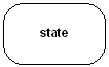

## 组物件:

分组物件可以被定义为一种机制，一个UML模型族元素。只能有一个分组物件:

## 包:

封装是唯一一个组物件可收集结构和行为的东西。

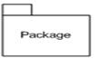

## 注解物件:

注释物件可以被定义为一种机制来捕捉UML模型元素的言论，说明和注释。注是唯一一个注释物件可用的。

## 注释:

注意用于渲染意见，约束等的UML元素。

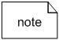

## (2) 关系 :

关系是另一个最重要的构建块UML。它显示元素是如何彼此相关联，此关联描述的一个应用程序的功能。

有四种可用的关系。

## 依赖关系:

依赖是两件事情之间的关系，其中一个元素的变化也影响到另一个。

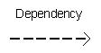

## 协作:

协作基本上是一组链接UML模型元素连接。它还介绍了多少对象在这种关系中的一部分。

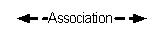

## 泛化:

泛化可以被定义为一个专门的元件连接关系与一个广义的元素。它基本上描述了在对象世界中的继承关系。

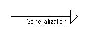

## 实现:

可以被定义为两个元件之间的关系，其中实现。一个元素描述了一些没有实现的责任，这和其他人实现他们。这种关系存在的情况下的接口。

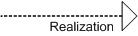

## (3) UML图:

UML图的整个讨论的最终输出所有要素，关系用于使一个完整的UML图，图中表示的系统。

UML图的视觉效果的整个过程中是最重要的部分。所有其他元素被用来制造一个完整的单。

UML包括以下九项图和下面的章节中描述的细节。

1.  类图
2.  对象图
3.  用例图
4.  序列图
5.  协作图
6.  活动图
7.  状态图
8.  部署关系图
9.  组件图

在本教程的后续章节中，我们将讨论所有这些图。

 