# UML基本表示法 - UML

UML是流行的图解符号。我们都知道，UML是可视化，说明，构建和记录软件和非软件系统的组成部分。这里的可视化是最重要的部分，需要被理解和记忆。

UML符号是最重要的建模元素。适当有效地使用符号是非常重要的一个完整的，有意义的模型。该模型是无用的，除非它的目的是正确描绘。

所以学习符号应该从一开始就强调。不同的符号可用于事物和关系。 UML图使用的符号物件和关系。可扩展性是另一个重要的功能，这使得UML更加强大和灵活。

本章还介绍了更详细的UML基本表示法。这仅仅是一个扩展的UML构建块段，我已经在前面的章节中讨论。

## 结构化物件:

用图形表示法中使用的结构物件是UML中最广泛使用的。这些被认为是为UML模型的名词。以下是结构的东西的列表。

*   类
*   接口
*   协作
*   用例
*   活动类
*   组件
*   节点

## 类注释:

下面的图表示的UML类。该图被分为四个部分。

*   顶端部分被用来命名类。
*   第二个是用来显示类的属性。
*   第三部分是用来描述由类执行的操作。
*   第四部分是可选的显示附加组件。

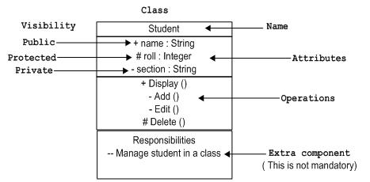

类是用来表示对象。对象可以是任何性质和职责。

## 对象表示法:

该对象表示以同样的方式作为类。唯一的区别是有下划线的名称，如下图所示。

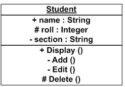

由于对象是实际执行的一类被称为类的实例。因此，它具有相同的使用作为类。

## 接口表示法:

接口是用圆来表示，如下所示。它有一个名称，一般写成下面的圆圈。

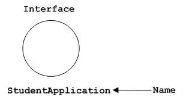

接口是用来描述的功能，而不执行。界面就像一个模板，定义不同的功能不执行。当一个类实现了接口，也按要求实现的功能。

## 协作表示法:

协作表示由eclipse 虚线如下所示。它有一个名字，里面写eclipse。 

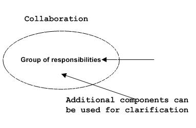

协作表示职责，一般职责是在一组。

## 用例表示法:

用例表示它里面的一个名字作为eclipse。它可能包含更多的责任。

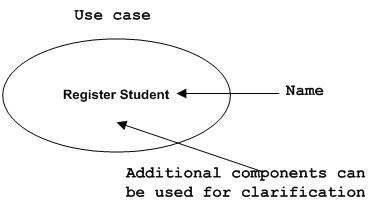

用例是用来捕捉系统的高层次功能。

## 角色表示法:

某些内部或外部的与系统进行交互的实体，可以被定义为一个角色。

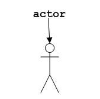

角色是在用例图描述内部或外部实体。

## 初始状态表示法：

初始状态被定义，以显示开始的一个过程。这个符号在几乎所有的图。

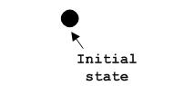

初始状态的表示法的用法是显示的一个过程的起点。

## 最终状态表示法：

最终状态是用来显示的一个过程的结束。这种表示法也可以用来在大部分的图中描述的目的。

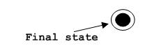

最终状态表示法的用法是显示一个过程的终止点。

## 活动类表示法：

活动类类似于一类具有扎实的边界。活动类一般是用来描述一个系统的并发行为。

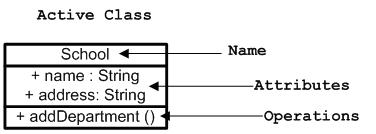

活动类是用来表示在一个系统的并发性。

## 元件表示法：

UML中的一个组件，如下图所示名称里面。在必要时，可以添加额外的元素。

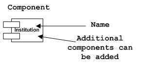

元器件是用来表示系统的任何部分的UML图。

## 节点表示法：

UML中的一个节点表示的一个方盒子，如下图所示，同一个名字。一个节点表示一个物理的系统组件。

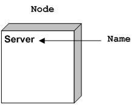

节点用来表示物理系统的一部分，如服务器，网络等

## 行为物件：

动态部分是UML中最重要的元素之一。 UML有一个强大的功能集，代表软件和非软件系统的动态部分。这些功能包括交互和状态机。

相互作用可分为两种类型：

*   顺序（序列图）
*   协作（协作图）

## 交互表示法：

交互基本上是两个UML组件之间的信息交换。下图表示交互中使用不同的符号。

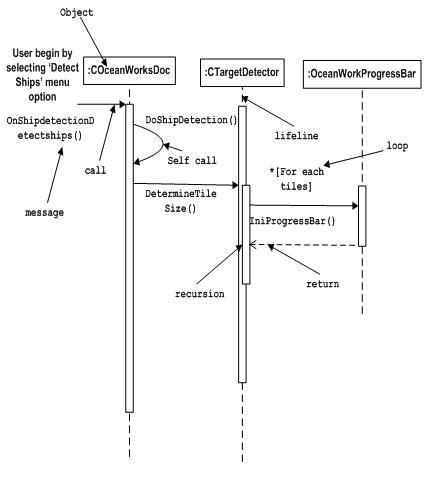

交互是用来表示一个系统的组件之间的通信。

## 状态机表示法：

状态机描述的组件在其生命周期的不同状态。在下面的图中描述的符号。

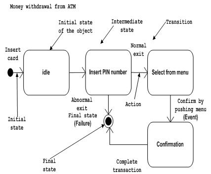

状态机是用来描述一个系统组件的不同状态。状态可以是活动，空闲或任何其他根据情况。

## 分组物件：

组织的UML模型设计的最重要的方面之一。 UML中只有一个元件即可用于分组，也就是包。

## 包表示法:

包装信息书写方式如下表所示，这是用来包装系统组成部分的。

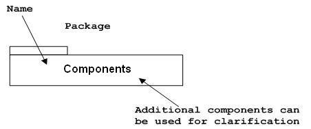

