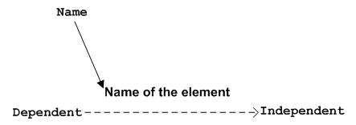
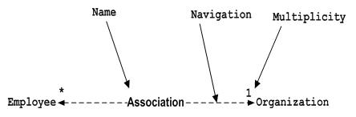
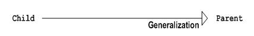
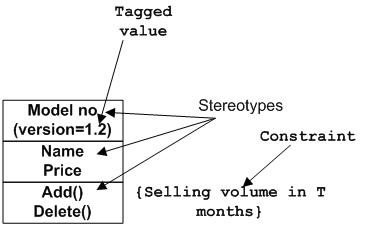

# 关系

模型是不完整的，正确的描述，除非元素之间的关系。关系给出了一个UML模型的意思。以下是UML中提供了不同类型的关系。

*   Dependency
*   Association
*   Generalization
*   Extensibility

## 依赖表示法：

依赖是UML元素的一个重要方面。它描述了相关的元素和方向上依赖关系。

依赖关系的虚线箭头表示，如下所示。箭头代表的独立元素，另一端的依赖元素。

依赖关系是用来表示一个系统的两个元素之间的依赖。

## 协作表示法：

协作介绍UML图中的元素相关联。简单的一句话，它介绍了多少个元素参与互动。

联合会（无）两侧的箭头的虚线表示。两端代表两个相关联的元素，如下所示。在两端（1，*等）的多样性也提到多少对象相关。

协作是用来表示一个系统的两个元素之间的关系。

## 泛化表示法：

泛化介绍了面向对象世界的继承关系。这是父与子的关系。

泛化为代表的空心箭头，如下图所示箭头。的一端表示的父元素和子元素的另一端。

泛化是用来描述一个系统的两个元素的亲子关系。

## 可扩展性表示法:

所有的语言（编程或模型）有某种机制来扩展其功能类似的语法，语义等UML还具有以下机制来提供可扩展性功能。

*   定型观念(代表新元素)
*   标记值 (代表新的属性)
*   约束 (代表界限)

可扩展标记来增强语言的权力。它基本上是用来表示一些额外的系统行为的附加元素。这些额外的行为，不包括可用的标准符号。

 