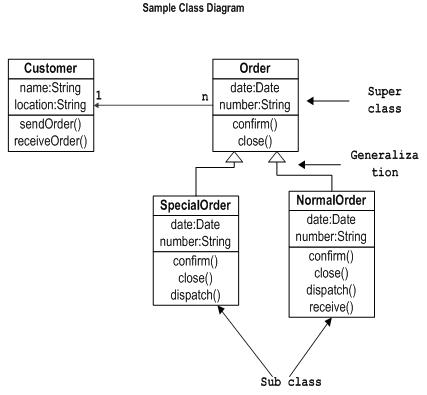

# UML类图 - UML

## 概述:

类图是静态图。它代表了一个应用程序的静态视图。类图不仅用于可视化描述和记录系统的不同方面，但也为构建可执行代码的软件应用程序。

类图描述一类的属性和操作，也对系统的约束。被广泛应用于类图的建模的面向对象的系统中，因为它们是唯一的，可以直接映射到面向对象的语言的UML图。

类图显示的集合类，接口，关联，协作和约束。它也被称为作为结构图。

## 目的:

类图的目的是模型的一个应用程序的静态视图。类图是唯一的图可以直接映射到面向对象的语言，因此广泛应用于施工时间。

[UML](http://www.yiibai.com/html/uml/)图，像活动图，顺序图只能给应用程序，但顺序流类图是一个有点不同。所以它是最流行的UML图编码社区。

因此，类图的目的可概括为：

*   分析和设计应用程序的静态视图。

*   描述一个系统的责任。

*   基地组件图和部署图。

*   正向和逆向工程。

## 如何画类图？

类图是最流行的用于建设软件应用程序的UML图。所以学习的类图的绘制过程是非常重要的。

类图有很多的属性来考虑，同时绘制，但这里的图将被视为从顶层视图。

类图基本上是一个系统的静态视图的图形表示，代表不同方面的应用。因此，集合类图表示整个系统。

画类图时，应记住以下几点：

*   名称应该是有意义的类图描述面向系统。

*   应事先确定的每个元素之间的关系。

*   应清晰标明每个类职责（属性和方法）。

*   对于每个类的属性的最小数量应符合规定。因为不必要的属性将使图表复杂。

*   使用了以下注释有否要求来描述图中的某些方面。因为上面的附图，它应该是可以理解的开发者/编码器。

*   最后，在最终版本之前，该图应绘制在普通纸上尽可能多次，使其纠正和返工。

现在，下面的图是一个二阶系统的一个应用程序的一个例子。它描述了整个应用程序的一个特定方面。

*   首先所有订单及客户被认定为系统的两个要素，他们有一个一对多的关系，因为一个客户可以有多个订单。

*   我们将保持Order类是一个抽象类，它有两个具体的类（继承关系）SpecialOrder 和 NormalOrder。

*   两个继承类Order类的所有属性。此外，他们有额外的功能 _dispatch ()_ 和 _receive ()_.

因此，下面的类图已经绘就考虑到所有上述提到的几点：

## 在哪里使用类图？

类图是一个静态图，它是用来模拟一个系统的静态视图。静态视图描述了系统的词汇。

也被认为是类图作为基础组件图和部署图。类图不仅用于可视化系统的静态视图，但它们也可用于构建可执行代码的任何系统中的前向和反向工程。

UML图一般不直接映射到任何面向对象的编程语言，但在类图是一个例外。

类图清楚地显示了映射面向对象语言，如Java，C++等，因此，从实际经验的类图通常用于构建用途。

因此，一个简短的类图用于：

*   描述系统的静态视图。

*   显示静态视图中的元素之间的协作。

*   由系统执行的功能的描述。

*   构建软件应用面向对象的语言。

 