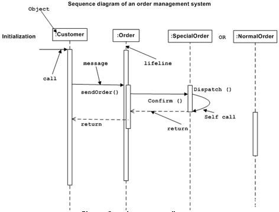
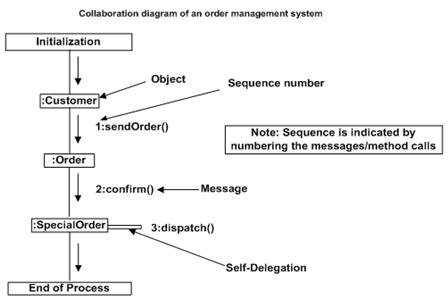

# UML交互图 - UML

## 概述:

从名字交互作用很明显，图中是用来描述一些不同的模型中的不同元素之间的相互作用。所以，这种相互作用是动态行为的系统的一部分。

这种互动行为表示UML中的两个图，被称为序列图和协作图。这两个图的基本宗旨是相似的。

序列图强调时间顺序的消息和协作图注重发送和接收消息的对象的组织结构。

## 目的:

交互图的目的是可视化系统的交互行为。载入可视化的交互是一个困难的任务。因此，解决方案是使用不同类型的模型来捕获不同方面的相互作用。

这就是为什么序列和协作图是用来捕获动态性质，但是从不同的角度。

因此，交互图而言，可以描述为：

*   捕捉一个系统的动态行为。

*   来描述该系统中的消息流。

*   来描述对象的结构组织。

*   为了描述对象之间的互动。

## 如何绘制交互图？

正如我们已经讨论交互图的目的是捕捉系统的动态环节。因此，动态捕捉方面，我们需要了解一个动态的环节是，它是如何可视化。动态方面可以定义为在一个特定的时刻运行的系统快照。

我们有两种类型UML交互图。一个是序列图，另一种是在协作图。序列图捕获从一个对象到另一个的时间顺序的消息流和协作图描述系统中对象的组织参加在消息流中。

因此，下面是确定之前绘制交互图：

*   参与互动的对象。

*   对象之间的消息流。

*   消息的顺序流程。

*   对象的组织。

以下是两个交互图建模的订单管理系统。第一图是一个顺序图，第二个是在协作图。

## 序列图：

序列图有四个对象（客户，订单，特殊订单和正常订单）。

下面的关系图所示的消息序列为SpecialOrder对象和NormalOrder对象在相同的情况下使用。现在重要的是要了解的时间顺序的消息流。消息流无关，但一个对象的方法调用。

首先调用的是sendOrder（），这是一个订单对象的方法。在下一次调用_confirm ()，_这是一个方法SpecialOrder对象的最后调用_Dispatch ()_，它是一种方法的SpecialOrder对象。所以这里的图主要描述的方法调用从一个对象到另一个，在系统运行时这也是实际情况。

## 协作图：

第二交互图，协作图。它显示的对象组织，如下所示。在这里，在协作图的方法调用序列是表示，由一些数字技术，如下所示。该数字表示方法如何被称为此起彼伏。我们已经采取了相同的订单管理系统，协作图来描述。

这些调用方法类似的序列图。但不同的是，序列图中未介绍的对象组织，而协作图中示出的对象的组织。

现在选择这两个图表之间主要强调的是需求类型。如果时间序列是很重要的，那么序列图中被使用，并且，如果需要的组织，那么使用协作图。

## 在哪里使用交互图？

我们已经讨论了交互图是用来描述一个系统的动态本质。现在，我们将进入实用化的情况下，使用这些图。要了解实际应用中，我们需要了解的基本性质顺序图和协作图。

这两个图的主要目的，是相似的，因为它们是用来捕捉系统的动态行为。但具体的目的，更重要的是阐明和理解。

序列图是用来捕获从一个对象到另一个消息流的顺序。和协作图用来描述参与相互作用中的对象的结构组织。一个单一的图是不是足以说明整个系统的动态环节，这样的一套图是用来捕获的是作为一个整体。

使用交互图，当我们想要了解的消息流和组织结构。消息流装置控制流从一个对象到另一个序列和结构组织的装置，在一个系统中的元素的视觉组织。

在一份简短的以下交互图的用法：

*   按时间顺序的控制流建模。

*   为了模拟流结构组织控制。

*   对于正向工程。

*   逆向工程。

 