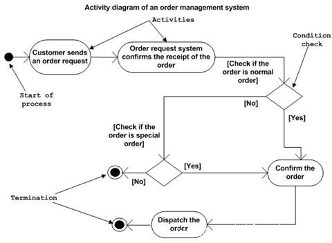

# UML活动图 - UML

## 概述:

活动图是另一个重要的UML图来描述系统的动态方面。

活动图基本上是代表流程形成一个活动到另一个活动的流程图。活动可以被描述为一个系统的操作。

因此，绘制控制流从一个操作到另一个。此流可以是连续的，支链的或同时的。活动图处理所有类型的流程控制，通过使用不同的元素，如交叉、加入等

## 目的:

活动图的基本用途是其他四个图类似。它能够捕捉到该系统的动态行为。其他四幅图是用来显示从一个对象到另一个消息流，但用来显示消息流从一个活动到另一个活动图。

活动是一个特别的系统的操作。活动图不仅用于可视化系统的动态性质，但它们也可用于通过使用正向和逆向工程技术来构建可执行的系统。唯一缺少的东西在活动图的消息部分。

它并不显示任何消息流程从一个活动到另一个。活动图是一段时间视为流程图。虽然图中看起来像一个流程图，但事实并非如此。它显示不同的流程，如并行，分支，并发单。

因此，目的可以被描述为：

*   绘制活动流程系统。

*   描述的顺序从一个活动到另一个。

*   描述系统并行，分支，并发流。

## 如何绘制活动图？

活动图主要用于为流程图包括由系统执行的活动。但活动图是不完全的，因为他们有一些额外的功能流程图。这些额外的功能，包括分支，平行流，泳道等

之前绘制活动图，活动图中使用的元素，我们必须有一个清醒的认识。活动图的主要元素是活动本身。一个活动是由系统执行的功能。确定活动后，我们需要了解他们是如何相关的约束和条件。

所以在绘制活动图，我们应该确定以下要素：

*   活动

*   交互

*   条件

*   约束

上述参数确定后，我们需要做一个心理布局整个流程。这种心理的布局转化成一个活动图。

下面是一个例子，订单管理系统的活动图。在图中确定了四个活动都与条件。其中重要的一点应该清楚地了解活动图不能完全匹配的代码。活动图了解活动流程，主要用于企业用户。

下图绘制的四个主要活动：

*   由客户发送订单

*   收到订单

*   确认订单

*   分发订单

收到订单后请求状态进行检查，以检查它是否是正常的或特殊的顺序。不同的顺序确定之后，执行调度活动，并标记为终止进程。

## 在哪里使用活动图？

活动图的基本用法是类似于其他四个UML图。的具体用法是模拟控制流从一个活动到另一个。该控制流程不包括消息。

活动图是适用于该系统的活动流程建模。应用程序可以有多个系统。活动图也抓住了这些系统，并介绍了流程从一个系统到另一个。在其他图中，这个特定的用法，不提供。这些系统可以是数据库，外部队列或任何其他系统。

现在，我们将看看活动图到实际应用。从上面的讨论，很显然，活动图是来自一个非常高的级别。因此，它给出了一个系统的高级视图。这种高层次的观点主要是针对企业用户或任何其他人而不是一个技术人员。

此图是用来模拟活动却都业务需求。因此，图有业务的理解，而实施细节上更具冲击力。

以下是活动图的主要用途：

*   使用业务建模工作流程。

*   建模的业务需求。

*   高层次的理解系统的功能。

*   调查在后一阶段的业务需求。

 