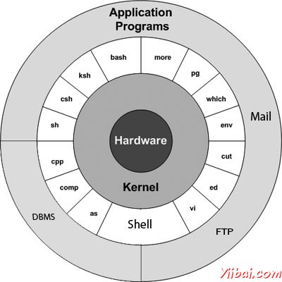

# Unix是什么？ - Unix

## Unix 是什么?

UNIX操作系统是一组程序，作为计算机和用户之间的链接。

分配系统资源并协调所有的相关的详细信息的计算机的内部的计算机程序被调用的操作系统或内核。

用户与内核通信通过一个程序被称为shell。 shell是一个命令行解释器，它把由用户输入的命令，并将其转换成语言，理解由内核。

*   Unix是最初开发于1969年，由一群在贝尔实验室，AT＆T员工，包括Ken Thompson, Dennis Ritchie, Douglas McIlroy, and Joe Ossanna.

*   可以在市场上有各种不同的Unix变种。Unix的Solaris，AIX，HP UNIX，BSD是几个例子。 Linux是Unix的一种，这是免费提供的。

*   有几个人可以同时使用UNIX计算机，因此，UNIX被称为一个多用户系统。

*   用户也可以在同一时间运行多个程序，因此UNIX被称为多任务。

## UNIX架构：

下面是在UNIX系统的基本框图：



所有版本的UNIX的主要概念，是以下四个基础：

*   核心: 内核是操作系统的心脏。它与硬件和内存管理，任务调度和文件管理等任务。

*   Shell: shell是实用工具，处理您的请求。当你在终端键入命令，shell解释命令和调用的程序。shell采用标准语法的所有命令。C shell中Bourne shell和Korn外壳是最有名的shell，可与大多数的Unix变种。

*   命令和实用程序: 有各种不同的命令和实用程序，可以使用和活动。 cp, mv, cat 和 grep等命令和实用程序的几个例子。有超过250个标准命令加上无数人通过第三方软件提供。所有的命令随之而来的各种可选方案。

*   文件和目录: UNIX中的所有数据被组织成文件。所有文件被组织成目录。这些目录被组织成一个树形结构，称为文件系统。

## 系统启动时：

如果有一台电脑，其中有UNIX操作系统上安装，那么只需要打开其电源，使用它。

只要打开电源，系统开始启动，最后它会提示登录到系统，这是一个活动登录到系统并使用它。

## 登陆 Unix:

当第一次连接到UNIX系统，通常会看到一个提示，如下面：

```
login:
```

## 要登录：

1.  有准备好用户ID和密码（用户识别）。请与系统管理员联系，如果还没有具备这些。

2.  在登录提示符下，键入您的用户ID，然后按ENTER键。userid是大小写敏感的，所以要确保键入它正是为系统管理员指派的。

3.  在密码提示符，键入密码，然后按ENTER键。密码是区分大小写。

4.  如果提供了正确的用户ID和密码，那么将被允许进入系统。如下的东西在屏幕上的信息和消息。

```
login : amrood
amrood's password:
Last login: Sun Jun 14 09:32:32 2009 from 62.61.164.73
$
```

它会提供一个命令提示符（有时称为$提示符），在那里可以输入一切命令。例如，检查日历，需要键入cal命令如下：

```
$ cal
     June 2009
Su Mo Tu We Th Fr Sa
    1  2  3  4  5  6
 7  8  9 10 11 12 13
14 15 16 17 18 19 20
21 22 23 24 25 26 27
28 29 30

$
```

## 修改密码：

所有的Unix系统需要输入密码，以帮助确保文件和数据保持自己的系统本身是安全。下面是步骤更改密码：

1.  开始时，输入passwd命令提示，如下图所示。

2.  输入您目前正在使用的旧密码。

3.  输入您的新密码。始终保持密码足够复杂，因此，没有任何人可以猜测它。但要确保你记住它。

4.  您将需要再次输入验证密码。

```
$ passwd
Changing password for amrood
(current) Unix password:******
New UNIX password:*******
Retype new UNIX password:*******
passwd: all authentication tokens updated  successfully

$
```

注：显示星号（*），只是为了显示位置，需要输入当前密码和新密码，否则系统它不会告诉你，当键入任何字符。

## 目录和文件列表：

UNIX中的所有数据被组织成文件。所有文件被组织成目录。这些目录被组织成一个树形结构，称为文件系统。

可以使用ls命令列出所有的文件或目录，目录中可用。下面的例子使用ls命令使用-l选项。

```
$ ls -l
total 19621
drwxrwxr-x  2 amrood amrood      4096 Dec 25 09:59 uml
-rw-rw-r--  1 amrood amrood      5341 Dec 25 08:38 uml.jpg
drwxr-xr-x  2 amrood amrood      4096 Feb 15  2006 univ
drwxr-xr-x  2 root   root        4096 Dec  9  2007 urlspedia
-rw-r--r--  1 root   root      276480 Dec  9  2007 urlspedia.tar
drwxr-xr-x  8 root   root        4096 Nov 25  2007 usr
-rwxr-xr-x  1 root   root        3192 Nov 25  2007 webthumb.php
-rw-rw-r--  1 amrood amrood     20480 Nov 25  2007 webthumb.tar
-rw-rw-r--  1 amrood amrood      5654 Aug  9  2007 yourfile.mid
-rw-rw-r--  1 amrood amrood    166255 Aug  9  2007 yourfile.swf

$
```

这里以d..... 开头的条目.....表示目录。例如UML，univ和girlspedia的其余的条目目录和文件。

## 你是谁？

当登录到系统，可能想知道： Who am I?

最简单的方法找出“who you are”，就是要进入whoami命令：

```
$ whoami
 amrood

$
```

在系统尝试。此命令列出当前登录的帐户名。可以试试，who am i 命令以及获得有关自己的信息。

## 谁在登录了？

有时你可能有兴趣知道是谁在同一时间也登录到计算机。

有三个命令可以，根据多少想了解其他用户： users, who 和 w.

```
$ users
 amrood bablu qadir

$ who
amrood ttyp0 Oct 8 14:10 (limbo)
bablu  ttyp2 Oct 4 09:08 (calliope)
qadir  ttyp4 Oct 8 12:09 (dent)

$
```

在系统上尝试w命令来检查输出。这将列出几个相关的信息系统中登录的用户。

## 注销：

当完成会话，你需要退出系统，以确保没有其他人访问您的文件，而伪装成你。

## 要注销：

1.  只需键入logout命令，在命令提示符下，该系统会清理一切并断开连接

## 系统关机：

最一致的方式通过命令行正确关闭一个Unix系统是使用下面的命令：

| 命令 | 描述 |
| --- | --- |
| **halt** | Brings the system down immediately. |
| **init 0** | Powers off the system using predefined scripts to synchronize and clean up the system prior to shutdown |
| **init 6** | Reboots the system by shutting it down completely and then bringing it completely back up |
| **poweroff** | Shuts down the system by powering off. |
| **reboot** | Reboots the system. |
| **shutdown** | Shuts down the system. |

你通常需要超级用户或根（在Unix系统中最有特权的帐户）关闭系统，但一些独立或个人拥有的Unix服务器，管理用户和普通用户有时可以这样做。

 